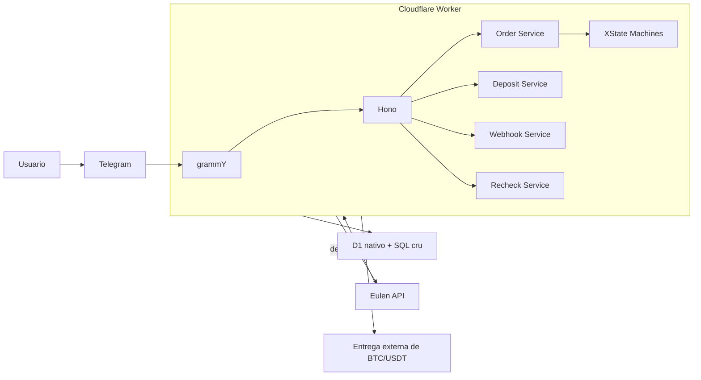

# Arquitetura Tecnica do MVP

> [!tip]
> Documento mestre: [[Misc/DePix/Contexto|Contexto]]
>
> Fluxo funcional: [[Misc/DePix/Faturamento Automações|Faturamento Automacoes]]
>
> Backlog: [[Misc/DePix/Backlog Scrum do MVP|Backlog Scrum do MVP]]

## Objetivo

Descrever a arquitetura minima do MVP ja alinhada ao stack OSS escolhido.

## Decisao de arquitetura

- `Cloudflare Worker` unico
- `Hono` como borda HTTP
- `grammY` para Telegram
- `XState` para maquina de conversa e do pedido
- `Cloudflare D1` com SQL cru via API nativa
- `Vitest` + integracao de testes do `Cloudflare Workers` + `MSW`
- sem microservicos e sem fila no MVP

## Visao do sistema

## Componentes

### 1. `Hono`

Camada unica de entrada HTTP do MVP.

Rotas minimas:

- `GET /health`
- `POST /telegram/webhook`
- `POST /webhooks/eulen/deposit`
- `POST /ops/recheck/deposit`

### 2. `grammY`

Camada do Telegram dentro do mesmo Worker.

Responsabilidades:

- receber o webhook do Telegram
- tratar comandos e mensagens
- conduzir o fluxo `ativo -> valor -> carteira`
- devolver QR e mensagens de status

### 3. Servicos de aplicacao

Separacao minima recomendada:

- `order service`: cria e atualiza o pedido
- `deposit service`: chama `deposit`, aplica split e persiste cobranca
- `webhook service`: processa evento da Eulen
- `recheck service`: usa `deposit-status` e `deposits` quando preciso

### 4. `XState`

Camada de estado explicito do MVP.

Responsabilidades:

- dirigir a conversa do Telegram
- controlar transicoes validas do pedido
- evitar `if/else` espalhado entre bot, servicos e webhook
- deixar os eventos principais claros no codigo
### 5. `Cloudflare D1`

Persistencia unica do MVP com SQL cru parametrizado usando a API nativa do `D1`.

Ela deve guardar:

- estado da conversa
- pedido
- cobranca
- historico de eventos externos

### 6. Client Eulen

Camada isolada de integracao HTTP.

Responsabilidades:

- `ping`
- `deposit`
- `deposit-status`
- `deposits`
- `Authorization`
- `X-Nonce`
- `X-Async`

### 7. Saida externa de entrega

So existe para `BTC` e `USDT`.

No MVP, ela nao entra na API da Eulen. O sistema apenas libera uma saida clara para o fluxo externo de entrega.

## Modelo minimo de dados

### `orders`

- `orderId`
- `userId`
- `channel`
- `productType`
- `amountInCents`
- `walletAddress`
- `currentStep`
- `status`
- `splitAddress`
- `splitFee`
- `createdAt`
- `updatedAt`

### `deposits`

- `orderId`
- `depositId`
- `nonce`
- `qrCopyPaste`
- `qrImageUrl`
- `externalStatus`
- `expiration`
- `createdAt`
- `updatedAt`

### `deposit_events`

- `orderId`
- `depositId`
- `source`
- `externalStatus`
- `bankTxId`
- `blockchainTxID`
- `rawPayload`
- `receivedAt`

## Fluxos principais

### 1. Conversa e pedido

1. `grammY` recebe a mensagem.
2. `XState` calcula a proxima transicao valida.
3. `order service` atualiza `currentStep` no banco.
4. Quando os dados ficam completos, o pedido sai de `draft`.

### 2. Cobranca

1. `deposit service` gera `nonce`.
2. Chama `deposit` com split.
3. Persiste `depositId`, QR e status inicial.
4. O bot responde com os dados de pagamento.

### 3. Confirmacao

1. `webhook service` recebe o evento da Eulen.
2. Persiste o payload em `deposit_events`.
3. `XState` aplica a transicao valida do pedido.
4. Atualiza `orders` e `deposits`.
5. Decide conclusao, fila manual ou entrega externa.

### 4. Recheck

1. Se o webhook falhar ou ficar duvidoso, `recheck service` consulta `deposit-status`.
2. Se a divergencia for maior, consulta `deposits` por janela.
3. O resultado corrige o estado interno.

## Logs

Cada evento relevante deve carregar:

- `orderId`
- `depositId`
- `nonce`
- `currentStep`
- `externalStatus`
- `requestId`, se existir

Nunca logar:

- token JWT
- segredo do webhook
- headers sensiveis completos

## Testes

Cobertura minima do MVP:

- unitarios da regra de pedido, split e mapeamento de status
- unitarios das maquinas de estado
- integracao do client Eulen
- webhook com idempotencia
- fluxo critico completo do pedido

Stack definida:

- `Vitest`
- integracao de testes do `Cloudflare Workers`
- `MSW`
- `XState`
