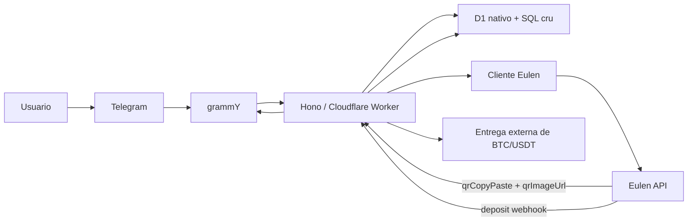

# Faturamento e Automacoes do MVP

> [!tip]
> Documento mestre: [Contexto.md](./Contexto.md)
>
> Arquitetura: [Arquitetura Tecnica do MVP.md](./Arquitetura%20Tecnica%20do%20MVP.md)
>
> Backlog: [Backlog Scrum do MVP.md](./Backlog%20Scrum%20do%20MVP.md)

> [!note]
> A referencia canonica de integracao agora fica em [docs/Pix2DePix API - Documentacao Completa.md](./docs/Pix2DePix%20API%20-%20Documentacao%20Completa.md).

## Objetivo

Definir como o MVP usa a API da Eulen/DePix no fluxo real de venda, cobranca e confirmacao.

## Decisoes travadas do MVP

- a API da Eulen entra como camada de cobranca e confirmacao
- split faz parte obrigatoria do `deposit`
- `DePix` pode ser concluido dentro do fluxo da API
- `BTC` e `USDT` ficam com entrega final fora da API da Eulen
- o MVP sera implementado com `Hono`, `grammY`, `XState` e `Cloudflare D1` nativo com SQL cru

## Fluxo tecnico do MVP

## Stack usada no fluxo

| Camada | Escolha | Papel no MVP |
|---|---|---|
| HTTP e webhooks | `Hono` | rotas, middleware e borda do Worker |
| Telegram | `grammY` | webhook do bot, comandos e conversa |
| Estados | `XState` | conversa guiada e transicoes do pedido |
| Persistencia | `Cloudflare D1` + SQL cru via API nativa | pedido, cobranca, eventos e estado da conversa |
| Testes | `Vitest` + `Cloudflare Workers` + `MSW` | unitario, integracao, webhook e fluxo critico |

## O que usamos da API no MVP

- `Authentication` para token
- `Ping` para validar ambiente
- `Deposit (PIX -> DePix)` para criar a cobranca
- `DepositRequest` para o request
- `Webhook` para confirmacao principal
- `Deposit Status` para fallback por deposito
- `Deposits` para fallback por janela
- `Nonce` para idempotencia
- `Sync / Async call` para retry controlado

## Request real do `deposit` no MVP

| Campo | Origem | Uso |
|---|---|---|
| `amountInCents` | valor escolhido pelo usuario | cria a cobranca |
| `depixSplitAddress` | configuracao interna | direciona o split |
| `splitFee` | configuracao interna | define o split |
| `depixAddress` | carteira do usuario | so quando o produto for `DePix` |
| `X-Nonce` | sistema | idempotencia por intencao |
| `X-Async` | sistema | modo `auto` do fluxo |

> [!warning]
> `depixSplitAddress` e `splitFee` nunca devem vir do usuario final. Eles entram por configuracao interna do projeto.

> [!note]
> No runtime atual, esses dois campos ficam em `splitConfig` dentro do `TENANT_REGISTRY` de cada tenant. Sem `splitConfig.depixSplitAddress` e `splitConfig.splitFee`, a criacao do `deposit` deve falhar antes de chamar a Eulen.

## Fluxo de negocio

1. O usuario inicia o fluxo no Telegram.
2. `XState` dirige a conversa e o bot coleta ativo, valor e carteira.
3. O sistema cria ou atualiza um pedido em `draft`.
4. O sistema chama `deposit` com split.
5. O usuario recebe `qrCopyPaste` e `qrImageUrl`.
6. A Eulen confirma o pagamento via webhook.
7. O sistema atualiza o pedido e decide a saida final.

> [!note]
> O webhook principal de deposito agora faz validacao do segredo no header `Authorization`, persiste o callback em `deposit_events` e aplica o status externo em `deposits` e `orders`. O fallback direto por `deposit-status` tambem ja existe em `POST /ops/:tenantId/recheck/deposit`, enquanto o fallback por `deposits` continua como etapa separada.

## Status que importam

| Status externo | Tratamento interno |
|---|---|
| `pending` | aguardando pagamento |
| `depix_sent` | pagamento confirmado |
| `under_review` | fila manual |
| `error` | fila manual |
| `expired` | encerrar como expirado |
| `canceled` | encerrar como cancelado |
| `refunded` | encerrar como reembolsado |

> [!note]
> Para `DePix`, `depix_sent` pode encerrar o pedido. Para `BTC` e `USDT`, `depix_sent` confirma o faturamento e libera a entrega externa.

## Fallback

- usar `Deposit Status` para um deposito especifico
  - endpoint local: `POST /ops/:tenantId/recheck/deposit`
  - payload minimo: `depositEntryId`
  - trilha de auditoria: `deposit_events.source = "recheck_deposit_status"`
- usar `Deposits` para reconciliar por janela
- manter webhook como caminho principal; fallback entra so quando houver falha ou duvida

## Fora do MVP

- `Pix2FA`
- `Pix Messaging`
- `QR Delay`
- `User Info`
- `Withdraw`
- fila dedicada
- painel interno
