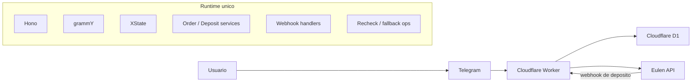

# DePix MVP

`depix-mvp` e uma plataforma multi-tenant de bot Telegram executada sobre um unico `Cloudflare Worker` e um unico banco `Cloudflare D1`. O repositorio ja contem a fundacao real do sistema: runtime do Telegram, integracao com Eulen, persistencia, deploy por ambiente, wiki versionada e automacoes de engenharia.

O ponto correto de leitura e este: o projeto nao esta em fase de ideia, mas tambem nao deve ser tratado como produto final completo. O `main` ja sustenta a base operacional e boa parte do fluxo funcional do MVP, enquanto a wiki em `docs/wiki/` concentra a camada institucional, de onboarding e de runbooks.

## Leitura rapida

- produto atual: bot Telegram multi-tenant para fluxo `DePix`
- stack principal: `Cloudflare Workers`, `Hono`, `grammY`, `XState`, `D1`, `TypeScript`
- integracoes externas centrais: Telegram e Eulen
- ambientes declarados: `local`, `test`, `production`
- documentacao profunda: [docs/wiki/Home.md](./docs/wiki/Home.md)

## O que este sistema e

O `depix-mvp` existe para permitir que parceiros operem o fluxo `DePix` em uma arquitetura compartilhada, com isolamento logico por `tenantId`, segredos fora do codigo e um unico runtime de borda.

Hoje o sistema cobre a vertical principal do MVP:

- recebe o usuario no Telegram
- conduz o pedido inicial por conversa
- cria a cobranca na Eulen
- persiste `orders`, `deposits` e `deposit_events`
- confirma pagamento por webhook
- oferece recheck e fallback operacional

## O que este sistema nao e

- nao e um checkout generico pronto para qualquer catalogo
- nao e um SaaS completo com painel administrativo
- nao e uma arquitetura distribuida com varios servicos independentes
- nao e a visao futura inteira da plataforma

A direcao de longo prazo fica separada em [docs/wiki/Visao-Futura-da-Plataforma.md](./docs/wiki/Visao-Futura-da-Plataforma.md), para nao misturar o MVP atual com a ambicao futura do produto.

## Estado atual do `main`

O `main` ja inclui:

- borda HTTP real em `Hono`
- runtime Telegram em `grammY` com despacho real de webhook
- normalizacao fail-closed do inbound do Telegram
- progresso inicial do pedido com `XState`
- persistencia em `D1` para `orders`, `deposits` e `deposit_events`
- integracao com a Eulen para criacao e confirmacao de depositos
- recheck operacional e fallback por janela
- notificacao assincrona no Telegram quando a conciliacao muda o estado visivel do pedido
- deploy por ambiente em `test` e `production`
- automacoes de triagem/planning/refinement de issues e review de PR

O `main` ainda nao representa um produto final completo. A leitura correta e:

- a fundacao tecnica e operacional ja existe
- a jornada funcional principal do bot ja avancou bastante
- ainda ha fatias de produto, observabilidade e endurecimento operacional para fechar o MVP publico com conforto

## Principais capacidades atuais

### Runtime e arquitetura

- um unico Worker principal em `src/index.ts`
- um unico banco principal em `D1`
- isolamento logico por `tenantId`
- contratos compartilhados em TypeScript para runtime, rotas e persistencia

### Fluxo Telegram

- `/start` inicia ou retoma pedido aberto
- `/help` responde sem criar pedido novo
- etapa `amount` interpreta BRL de forma conservadora
- etapa `wallet` valida enderecos DePix/Liquid
- etapa `confirmation` cria deposito real na Eulen
- `/cancel`, `cancelar` e `recomecar` controlam pedidos abertos com seguranca
- `/status` consulta o pedido relevante sem mutar o agregado

### Fluxo Eulen e conciliacao

- criacao de deposito com split por tenant
- webhook principal de deposito
- recheck por `deposit-status`
- fallback por `deposits`
- persistencia auditavel de eventos de deposito

### Engenharia e operacao

- `npm test` com runner sequencial para specs Node e Cloudflare
- `npm run typecheck` para contrato TypeScript
- `npm run cf:types` para tipos gerados do Worker
- wiki espelhada e versionada em `docs/wiki/`

## Arquitetura em leitura rapida



Principios centrais:

- um unico runtime principal
- um unico banco principal
- isolamento logico por `tenantId`
- segredos fora do codigo
- contratos HTTP explicitos nas bordas
- evolucao incremental sem proliferar servicos antes da hora

## Estrutura do repositorio

```text
src/                  Aplicacao, rotas, runtime, servicos, config e tipos
test/                 Suite automatizada
migrations/           Schema e migracoes do D1
docs/wiki/            Wiki espelhada e versionada
.github/workflows/    CI e automacoes do repositorio
scripts/              Scripts operacionais e de suporte
wrangler.jsonc        Configuracao do Worker e dos ambientes
```

Pontos de entrada principais:

- `src/index.ts`: bootstrap canonico do Worker
- `src/app.ts`: composicao do app `Hono`
- `src/routes/*.ts`: borda HTTP central
- `src/telegram/`: runtime e fluxo do Telegram
- `src/clients/eulen-client.ts`: client principal da Eulen

## Comecando rapido

### Pre-requisitos

- Node.js
- npm
- `wrangler` via dependencias do projeto
- `.dev.vars` para desenvolvimento local
- acesso aos segredos reais apenas quando o objetivo for operar `test` ou `production`

### Instalacao

```bash
npm install
```

### Desenvolvimento local

```bash
npm run dev
```

### Comandos essenciais

```bash
npm test
npm run typecheck
npm run cf:types
npm run db:migrate:local
npm run db:query:local
```

## Ambientes, segredos e deploy

Ambientes declarados em `wrangler.jsonc`:

- `local`
- `test`
- `production`

Regras importantes:

- `local` usa `.dev.vars`
- `test` e `production` usam `Cloudflare Secrets Store`
- segredos financeiros e tokens nao devem morar em codigo ou `vars` versionadas

Segredos por tenant cobrem:

- token do bot Telegram
- secret do webhook Telegram
- token da Eulen
- secret do webhook da Eulen
- endereco DePix/Liquid de split
- fee de split no formato esperado pela Eulen

Deploys canonicos:

```bash
npm run deploy:test
npm run deploy:production
```

Hosts publicos canonicos:

- `test`: `https://depix-mvp-test.dev865077.workers.dev`
- `production`: `https://depix-mvp-production.dev865077.workers.dev`

## Integracoes externas

### Telegram

O Telegram e o canal de entrada do usuario. O sistema trabalha com um bot por tenant, um webhook por tenant e runtime real em `grammY`.

### Eulen

A Eulen e a integracao responsavel por criar a cobranca `DePix`, devolver QR/copiar-e-colar, expor `deposit-status`, listar `deposits` e enviar o webhook principal de confirmacao.

## Documentacao e wiki

Este `README` e a camada de entrada. A wiki e a camada de profundidade.

Comece por aqui:

- [docs/wiki/Home.md](./docs/wiki/Home.md)
- [docs/wiki/Leitura-Inicial.md](./docs/wiki/Leitura-Inicial.md)
- [docs/wiki/Visao-Geral-do-Produto.md](./docs/wiki/Visao-Geral-do-Produto.md)
- [docs/wiki/Arquitetura-Geral.md](./docs/wiki/Arquitetura-Geral.md)
- [docs/wiki/Estrutura-do-Repositorio.md](./docs/wiki/Estrutura-do-Repositorio.md)
- [docs/wiki/Ambientes-e-Segredos.md](./docs/wiki/Ambientes-e-Segredos.md)
- [docs/wiki/Integracoes-Externas.md](./docs/wiki/Integracoes-Externas.md)
- [docs/wiki/Deploy-e-Runbooks.md](./docs/wiki/Deploy-e-Runbooks.md)
- [docs/wiki/Testes-e-Qualidade.md](./docs/wiki/Testes-e-Qualidade.md)
- [docs/wiki/Automacoes-e-Prompts.md](./docs/wiki/Automacoes-e-Prompts.md)

## Regras de interpretacao da documentacao

- o repositorio e a fonte de verdade tecnica
- a wiki e a camada institucional e navegavel
- quando houver diferenca entre estado atual e arquitetura-alvo, isso deve ficar explicito
- se uma afirmacao nao puder ser sustentada pelo `main`, ela nao deve entrar como fato

## Estado do MVP e limites atuais

O projeto ja sustenta desenvolvimento incremental serio, smoke tests reais e operacao controlada por ambiente. Ainda assim, a leitura correta nao e `produto pronto`; e `base operacional concreta com fechamento progressivo das ultimas fatias do MVP`.

Se o objetivo for onboarding rapido, use este `README` e siga para a wiki. Se o objetivo for validar comportamento, contratos ou operacao, confira o codigo e os runbooks correspondentes em `docs/wiki/`.
