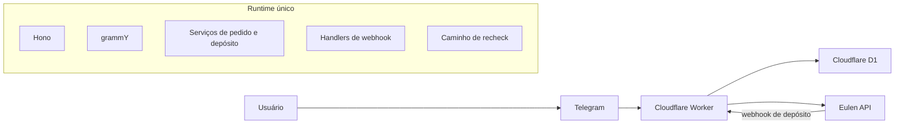

# DePix MVP

O DePix MVP é uma plataforma multi-tenant de bot Telegram construída sobre um único `Cloudflare Worker` e um único banco `D1`. O projeto existe para operar fluxos por parceiro com isolamento lógico por `tenantId`, infraestrutura compartilhada e um modelo documental em que o repositório continua sendo a fonte de verdade técnica.

Este repositório já está além de uma base vazia. A borda HTTP, o roteamento por tenant, o runtime do Telegram, a fundação do webhook da Eulen, a persistência em `D1` e a estrutura de deploy já estão no `main`. O que falta não é direção arquitetural; é a conclusão das últimas camadas funcionais do fluxo de produto.

## O Que Este Repositório Contém

- um único runtime em `Cloudflare Workers`
- borda HTTP em `Hono`
- runtime de bot em `grammY`
- resolução de tenant e segredos por tenant
- persistência em `D1` para `orders`, `deposits` e `deposit_events`
- integração com a Eulen para criação e confirmação de depósitos
- ambientes de `test` e `production` no Cloudflare
- documentação técnica versionada em `docs/`

## Estado Atual do Sistema

O `main` já inclui:

- despacho real do webhook do Telegram para o runtime do tenant
- fluxo inicial de resposta do Telegram para `/start`, texto comum e updates não suportados
- logs estruturados de outbound do Telegram com mapeamento explícito de erro
- webhook principal da Eulen com validação, idempotência base e persistência
- contexto de requisição multi-tenant ao longo do Worker
- modelo de segredos por tenant com `Cloudflare Secrets Store` em `test` e `production`

Ainda não está completo no `main`:

- o fluxo conversacional completo do bot
- o caminho operacional completo de recheck
- `XState` ja materializa e persiste o pedido inicial em `draft`, mas a progressao conversacional completa ainda nao foi ligada ao bot

A leitura correta do projeto é simples: a fundação da plataforma já existe, e o trabalho restante é a evolução controlada do fluxo de negócio.

## Arquitetura em Uma Leitura



Princípios centrais:

- um único runtime principal
- um único banco principal
- isolamento lógico por `tenantId`
- segredos fora do código
- contratos HTTP explícitos nas bordas
- evolução incremental sem proliferar serviços antes da hora

## Estrutura do Repositório

```text
src/                  Código da aplicação, rotas, runtime, serviços e config
test/                 Testes automatizados
migrations/           Schema e migrações do D1
docs/                 Documentação técnica versionada
docs/wiki/            Espelho reviewável da wiki do projeto
.github/workflows/    CI e automações do repositório
wrangler.jsonc        Configuração do Worker no Cloudflare
```

## Começando

### Pré-requisitos

- Node.js
- npm
- acesso ao Cloudflare com `wrangler`
- segredos locais em `.dev.vars` para desenvolvimento fora dos ambientes remotos

### Instalação

```bash
npm install
```

### Execução local

```bash
npm run dev
```

### Testes

```bash
npm test
```

### Geração de tipos do Worker

```bash
npm run cf:types
```

### Migrações locais do D1

```bash
npm run db:migrate:local
```

## Deploy

Test:

```bash
npm run deploy:test
```

Production:

```bash
npm run deploy:production
```

O projeto declara três ambientes em `wrangler.jsonc`:

- `local`
- `test`
- `production`

`test` e `production` usam `Cloudflare Secrets Store`. O desenvolvimento local continua usando `.dev.vars`.

## Segredos e Configuração por Tenant

O registro não sensível fica em `TENANT_REGISTRY`. Cada tenant aponta para nomes de bindings secretos, e o runtime materializa os valores reais em tempo de execução.

Os segredos por tenant incluem:

- token do bot Telegram
- secret do webhook do Telegram
- token da Eulen
- secret do webhook da Eulen
- endereço DePix/Liquid de split
- fee de split no formato esperado pela Eulen, como `1.00%`

Esses dados não devem morar em código versionado, `vars` operacionais hardcoded ou arquivos reais commitados.

## Integrações Externas

### Telegram

O Telegram é o canal de entrada do usuário. Hoje o repositório suporta:

- um bot por tenant
- um webhook por tenant
- despacho real do webhook para `grammY`
- fluxo inicial de resposta para `/start`, texto e updates fora do escopo principal

### Eulen

A Eulen é responsável pela criação da cobrança DePix e pela confirmação do pagamento. O repositório já inclui:

- validação do webhook
- tratamento base de idempotência
- atualização persistida dos agregados de depósito

O webhook de depósito é o caminho principal. O recheck continua sendo fallback e ainda não representa o fluxo operacional completo.

## Mapa de Documentação

Use este `README` como ponto de entrada rápido. Use a wiki espelhada e a documentação técnica para profundidade.

Comece por aqui:

- [docs/wiki/Home.md](./docs/wiki/Home.md)
- [docs/wiki/Leitura-Inicial.md](./docs/wiki/Leitura-Inicial.md)
- [docs/wiki/Arquitetura-Geral.md](./docs/wiki/Arquitetura-Geral.md)
- [docs/wiki/Integracoes-Externas.md](./docs/wiki/Integracoes-Externas.md)
- [docs/wiki/Ambientes-e-Segredos.md](./docs/wiki/Ambientes-e-Segredos.md)
- [docs/wiki/Testes-e-Qualidade.md](./docs/wiki/Testes-e-Qualidade.md)

Regras documentais:

- o repositório é a fonte de verdade técnica
- a wiki espelhada é a camada institucional e navegável
- `docs/` é a casa canônica da documentação técnica versionada
- documentação deve evoluir na mesma PR em que código, schema, integração ou operação mudarem de forma relevante

## Padrão de Trabalho

Este repositório foi desenhado para evoluir de forma incremental, mas não informal. Mudanças novas devem preservar:

- comportamento seguro por tenant
- logging operacional explícito
- disciplina no tratamento de segredos
- testes proporcionais ao risco da mudança
- atualização documental sempre que o sistema mudar de maneira relevante

## Resumo

O DePix MVP já tem a forma de uma plataforma real: roteamento multi-tenant, runtime do Telegram, integração com Eulen, persistência em `D1` e estrutura de deploy em Cloudflare já estão no lugar. O trabalho à frente é concluir o fluxo de produto em cima de uma fundação concreta, não inventar essa fundação do zero.
