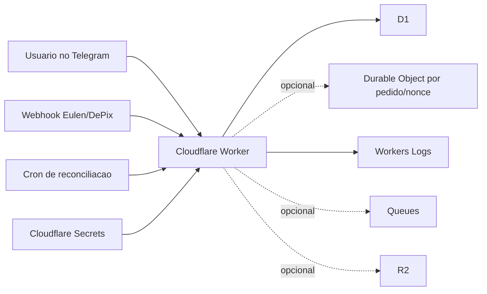

# Cloudflare para o MVP - Free Tier e Arquitetura Simples

> [!tip]
> Documento complementar a [[Misc/DePix/Faturamento Automações|Faturamento e Automações]] e [[Misc/DePix/Arquitetura Tecnica do MVP|Arquitetura Tecnica do MVP]].

## Objetivo

Definir quais recursos da Cloudflare podem ser usados no MVP com foco em:

- simplicidade operacional
- baixo custo inicial
- baixa manutencao
- boa resiliencia
- stack o mais unificada possivel

O recorte aqui e intencional: usar o que ja resolve o problema atual sem inventar plataforma demais.

> [!note]
> Pesquisa baseada em documentacao oficial da Cloudflare consultada em `2026-04-11`. Limites, precos e disponibilidade podem mudar depois dessa data.

## Pergunta central

Para o que temos hoje, qual e a forma mais simples de rodar esse sistema na Cloudflare sem criar dor de cabeca desnecessaria?

## Resposta curta

A composicao mais simples e coerente hoje e:

- `Workers` para runtime HTTP
- `D1` para persistencia principal
- `Cron Triggers` para reconciliacao
- `Workers Logs` para observabilidade minima

E usar os seguintes recursos apenas se houver necessidade real:

- `Durable Objects` para coordenacao forte, idempotencia e serializacao por pedido
- `Queues` para desacoplar tarefas assincronas
- `R2` para armazenar arquivos, payloads brutos ou comprovantes
- `KV` apenas para cache/configuracao leve
- `Secrets` para segredos operacionais
- `Turnstile` se surgir interface publica exposta
- `Pages` se precisarmos de uma pagina publica ou painel estatico simples

## Principios para este desenho

- Um unico runtime principal para receber Telegram, webhook da Eulen e endpoints internos.
- Uma fonte principal de verdade para pedidos, cobrancas e eventos.
- O minimo possivel de servicos diferentes no dia 1.
- Usar recursos nativos da Cloudflare so quando eles simplificarem a operacao de verdade.
- Evitar usar armazenamento eventual ou orientado a cache como banco principal.

## O que a Cloudflare Free Tier oferece e como isso encaixa no MVP

### 1. Workers

`Workers` devem ser o runtime principal do MVP.

Podem concentrar:

- webhook do Telegram
- webhook da Eulen
- endpoint de criacao de cobranca
- endpoints internos de status e operacao
- logica de negocio do fluxo

Pontos relevantes do free tier:

- `100.000 requests/dia`
- `10 ms` de CPU por invocacao no plano free
- `128 MB` de memoria
- `50` subrequests por invocacao
- `5` cron triggers por conta

Leitura pratica para o MVP:

- Para um bot e um webhook transacional pequeno, o free tier e suficiente para iniciar.
- O maior cuidado nao e memoria, e sim CPU por invocacao.
- Isso favorece handlers curtos, I/O simples e pouca logica pesada dentro do request.
- O desenho deve responder rapido ao webhook e delegar o resto para persistencia e reconciliacao.

### 2. D1

`D1` e o melhor candidato para ser a persistencia principal do MVP.

Ele encaixa bem para:

- pedidos
- cobrancas
- `depositId`
- `nonce`
- status interno
- historico de eventos
- reconciliacao
- consultas operacionais simples

Pontos relevantes do free tier:

- `5 milhoes` de rows read por dia
- `100.000` rows written por dia
- `5 GB` de storage total
- sem cobranca de egress

Leitura pratica para o MVP:

- Para o volume esperado no comeco, isso e mais que suficiente.
- D1 simplifica muito a vida porque e facil de consultar, inspecionar e auditar.
- Para esse caso, ele e mais simples como fonte principal de verdade do que tentar modelar tudo em `Durable Objects`.

> [!note]
> Inferencia arquitetural: embora `Durable Objects` tenham storage proprio, `D1` tende a ser melhor como base principal porque facilita consulta por listas, filtros, conciliacao, suporte operacional e historico. Para o estado atual do projeto, isso reduz mais dor de cabeca.

### 3. Durable Objects

`Durable Objects` estao disponiveis no free tier e podem usar backend `SQLite`.

Eles oferecem:

- coordenacao fortemente consistente por entidade
- estado privado por objeto
- SQL local ao objeto
- API de alarmes
- execucao single-threaded por objeto

Pontos relevantes do free tier:

- `100.000` requests por dia
- `13.000 GB-s` de duration por dia
- `5 milhoes` de rows read por dia
- `100.000` rows written por dia
- `5 GB` de storage total

Leitura pratica para o MVP:

- Eles sao excelentes quando precisamos garantir que um pedido, uma conversa ou um `nonce` seja tratado de forma serializada.
- Isso pode ser util para evitar corrida entre:
  - retry com o mesmo `nonce`
  - webhook duplicado
  - atualizacao simultanea de status
- Eles tambem podem disparar `alarms`, o que ajuda em expiracao e pequenos agendamentos por entidade.

Mas ha um ponto importante:

- `Durable Objects` nao sao a melhor escolha para virar o banco principal do sistema neste momento.
- Eles sao melhores como camada de coordenacao forte do que como repositorio central consultavel.

Recomendacao para agora:

- usar `Durable Objects` apenas se a logica de concorrencia realmente apertar
- nao comecar com arquitetura `DO-first`

### 4. Cron Triggers

`Cron Triggers` entram muito bem no MVP para reconciliacao.

Uso ideal aqui:

- buscar pedidos sem webhook
- rodar fallback com `deposit-status`
- executar reconciliacao com `deposits`
- fechar expiracoes
- gerar alertas operacionais simples

Pontos relevantes do free tier:

- `5` cron triggers por conta
- compartilham os limites normais de Workers

Leitura pratica para o MVP:

- Isso ja basta para um cron de reconciliacao, um de limpeza e talvez um terceiro de monitoramento.
- Nao precisamos de nada mais sofisticado no inicio.

### 5. Workers Logs

`Workers Logs` sao suficientes para observabilidade minima inicial.

Pontos relevantes do free tier:

- `200.000` eventos de log por dia
- retencao de `3 dias`

Leitura pratica para o MVP:

- Ja da para rastrear `orderId`, `nonce`, `depositId`, `qrId` e falhas.
- Para o MVP, isso atende bem se os logs forem estruturados e economicos.
- Nao precisa inventar stack externa de observabilidade no dia 1.

### 6. Analytics Engine

`Analytics Engine` existe no free tier e pode guardar metricas operacionais simples.

Pontos relevantes do free tier:

- `100.000` data points escritos por dia
- `10.000` consultas por dia

Leitura pratica para o MVP:

- Pode ser util para contadores e painis operacionais leves.
- Ainda assim, nao e obrigatorio no inicio.
- Primeiro vale acertar logs e persistencia basica.

### 7. KV

`Workers KV` tambem esta disponivel no free tier.

Pontos relevantes do free tier:

- `100.000` leituras por dia
- `1.000` escritas por dia
- `1.000` deletes por dia
- `1.000` list requests por dia
- `1 GB` de storage

Leitura pratica para o MVP:

- Serve para cache, configuracao leve e flags.
- Nao serve bem como fonte principal de verdade do fluxo.
- O limite de escrita diario e baixo para usar como base central do pedido.

Recomendacao para agora:

- nao usar `KV` para pedidos, cobrancas ou historico
- usar apenas se surgir uma necessidade clara de cache ou configuracao global

### 8. R2

`R2` pode ser util se o sistema precisar armazenar objetos.

Uso possivel aqui:

- payloads brutos de webhook
- comprovantes
- exportacoes
- anexos operacionais
- imagens estaticas de suporte

Pontos relevantes do free tier:

- `10 GB-month` de storage padrao por mes
- `1 milhao` de Class A operations por mes
- `10 milhoes` de Class B operations por mes
- egress para internet gratis

Leitura pratica para o MVP:

- E otimo se surgir necessidade de guardar artefatos.
- Mas ainda nao parece obrigatorio para o dia 1.
- Se o payload bruto puder ficar em D1 com tamanho controlado, talvez nem precisemos de `R2` no comeco.

### 9. Queues

`Cloudflare Queues` passou a fazer parte do free tier em `2026-02-04`.

Pontos relevantes do free tier:

- `10.000` operacoes por dia
- retencao maxima de `24 horas` no free tier
- ate `10.000` filas por conta

Leitura pratica para o MVP:

- Pode ser muito bom para desacoplar tarefas que nao precisam acontecer dentro do request principal.
- Exemplos:
  - envio de notificacoes
  - processamento operacional
  - reprocessamento leve
  - tarefas de entrega externa

Mas ainda assim:

- o free tier aqui e bem mais apertado
- cada mensagem costuma custar `write + read + delete`
- portanto `10.000 operacoes/dia` acabam virando por volta de `3.333` mensagens completas por dia

Recomendacao para agora:

- nao colocar `Queues` no centro do MVP
- usar apenas se precisarmos tirar trabalho do request principal

### 10. Pages

`Cloudflare Pages` pode ser usado para:

- landing page
- painel estatico simples
- documentacao publica
- pequena interface operacional

Pontos relevantes:

- requests a assets estaticos sao gratis e ilimitados
- `Pages Functions` contam na mesma cota de `Workers`

Leitura pratica para o MVP:

- Se precisarmos de um mini painel ou pagina de suporte, `Pages` encaixa muito bem.
- Se nao houver interface web agora, nao precisamos introduzir isso ainda.

### 11. Turnstile

`Turnstile` e gratis e pode ser usado independentemente de outros servicos da Cloudflare.

Pontos relevantes do plano free:

- gratis
- ate `20` widgets
- challenges ilimitados
- `10` hostnames por widget

Leitura pratica para o MVP:

- Muito util se criarmos pagina publica com formulario, painel simples ou endpoint sensivel exposto por browser.
- Para bot puro em Telegram, provavelmente ainda nao e prioridade.

### 12. Secrets

`Cloudflare Secrets` devem ser usados no MVP para armazenar segredos operacionais.

Uso direto aqui:

- token JWT da Eulen
- segredo de validacao do webhook
- token do bot do Telegram
- credenciais operacionais pequenas

Pontos relevantes:

- sao o mecanismo nativo da plataforma para valores sensiveis
- ficam disponiveis como bindings do Worker
- evitam expor segredos em codigo, repositório e configuracao plaintext

Leitura pratica para o MVP:

- Vamos usar `Secrets`.
- Isso reduz muito a dor de cabeca operacional.
- E a escolha mais simples e correta para um sistema pequeno rodando na Cloudflare.

### 13. Workflows

`Workflows` tambem esta incluido no plano free.

Pontos relevantes do free tier:

- `100.000` requests por dia compartilhados com Workers
- `10 ms` de CPU por invocacao
- `1 GB` de storage

Leitura pratica para o MVP:

- E interessante para orquestracoes longas e multi-etapa.
- Mas hoje seria sofisticacao precoce.
- `Cron + Worker + D1` e mais simples e suficiente para o problema atual.

### 14. Browser Rendering e Images

Existem free tiers para esses produtos, mas eles nao resolvem a dor principal do MVP agora.

Exemplos:

- `Browser Rendering`: `10 minutos/dia`
- `Images`: ate `5.000` transformacoes unicas por mes no free

Leitura pratica para o MVP:

- nao entram no desenho inicial

## O que eu usaria agora

### Stack minima recomendada

- `1 Worker` principal para Telegram, webhook da Eulen e endpoints internos
- `D1` como banco principal
- `1 Cron Trigger` para reconciliacao
- `Workers Logs` para trilha operacional
- `Secrets` para todos os segredos operacionais

### Stack minima com um pouco mais de robustez

- `1 Worker` principal
- `D1` como fonte principal de verdade
- `Durable Objects` so para coordenacao por `orderId` ou por `nonce`
- `1 Cron Trigger` para reconciliacao
- `Workers Logs`
- `Secrets` para todos os segredos operacionais

## Mapeamento direto entre necessidade e produto

| Necessidade | Produto Cloudflare | Usar agora? | Observacao |
|---|---|---|---|
| Runtime HTTP do bot e webhooks | `Workers` | Sim | Peca central do MVP |
| Persistir pedidos e cobrancas | `D1` | Sim | Melhor fonte principal de verdade |
| Garantir idempotencia e serializacao por entidade | `Durable Objects` | Talvez | So se concorrencia real aparecer |
| Reconciliacao automatica | `Cron Triggers` | Sim | Simples e suficiente |
| Logs operacionais | `Workers Logs` | Sim | Ja atende o MVP |
| Metricas operacionais | `Analytics Engine` | Talvez | Opcional no inicio |
| Cache/configuracao leve | `KV` | Nao, por enquanto | Nao usar como banco principal |
| Guardar arquivos e payloads grandes | `R2` | Talvez depois | So se realmente surgir artefato |
| Desacoplar tarefas assincronas | `Queues` | Talvez depois | Free tier mais apertado |
| Guardar token e segredos | `Secrets` | Sim | Escolha padrao do MVP |
| Pagina ou painel simples | `Pages` | Talvez depois | Bom se houver interface web |
| Anti-bot em interface publica | `Turnstile` | Talvez depois | Muito bom se existir front publico |
| Orquestracao longa | `Workflows` | Nao, por enquanto | Ainda e sofisticacao precoce |

## Decisao sobre segredos

Para este projeto, a decisao pratica e:

- usar `Cloudflare Secrets` para os segredos operacionais do MVP
- nao colocar token em codigo-fonte, `vars`, git ou configuracao plaintext
- manter a superficie de segredo minima e bem controlada

> [!note]
> Decisao arquitetural desta documentacao: vamos usar `Secrets` porque isso simplifica a operacao real do MVP, reduz risco operacional e combina melhor com uma stack enxuta toda na Cloudflare.

## Desenho minimo recomendado

## Decisao pratica para o momento atual

Se a meta e comecar simples, rapido e com o minimo de manutencao, a melhor decisao hoje e:

- `Workers + D1 + Cron + Logs + Secrets`

E so adicionar:

- `Durable Objects` quando houver problema real de concorrencia
- `Queues` quando houver trabalho assincrono que esteja pesando no request
- `R2` quando surgirem arquivos ou payloads grandes
- `Pages` e `Turnstile` quando existir interface web publica

## Resumo

Cloudflare hoje ja oferece no free tier quase tudo que o MVP precisa para nascer de forma simples. O centro do desenho deve ser `Workers` para execucao e `D1` para persistencia. `Cron Triggers` cobrem reconciliacao, `Workers Logs` cobrem observabilidade minima, e `Durable Objects` ficam como reforco de consistencia quando necessario. `KV`, `R2`, `Queues`, `Pages` e `Turnstile` existem como extensoes uteis, mas nao precisam entrar todos agora. O melhor desenho para este momento nao e o mais completo da plataforma, e sim o menor desenho que ja entrega velocidade, resiliencia e baixa manutencao.

## Fontes oficiais consultadas

- [Cloudflare Workers Pricing](https://developers.cloudflare.com/workers/platform/pricing/)
- [Cloudflare Workers Limits](https://developers.cloudflare.com/workers/platform/limits/)
- [Cloudflare D1 Pricing](https://developers.cloudflare.com/d1/platform/pricing/)
- [Cloudflare Durable Objects Pricing](https://developers.cloudflare.com/durable-objects/platform/pricing/)
- [SQLite-backed Durable Object Storage](https://developers.cloudflare.com/durable-objects/api/sqlite-storage-api/)
- [What are Durable Objects?](https://developers.cloudflare.com/durable-objects/what-are-durable-objects/)
- [Cloudflare Queues Pricing](https://developers.cloudflare.com/queues/platform/pricing/)
- [Cloudflare Queues Limits](https://developers.cloudflare.com/queues/platform/limits/)
- [Cloudflare Queues now available on Workers Free plan](https://developers.cloudflare.com/changelog/post/2026-02-04-queues-free-plan/)
- [Cloudflare R2 Pricing](https://developers.cloudflare.com/r2/pricing/)
- [Cloudflare Pages Functions Pricing](https://developers.cloudflare.com/pages/functions/pricing/)
- [Cloudflare Turnstile Plans](https://developers.cloudflare.com/turnstile/plans/)
- [Cloudflare Workers Secrets](https://developers.cloudflare.com/workers/configuration/secrets/)
- [Cloudflare Workflows Pricing](https://developers.cloudflare.com/workflows/reference/pricing/)
- [Cloudflare Workers Analytics Engine Pricing](https://developers.cloudflare.com/analytics/analytics-engine/pricing/)
- [Cloudflare Browser Rendering Pricing](https://developers.cloudflare.com/browser-rendering/platform/pricing/)
- [Cloudflare Images Pricing](https://developers.cloudflare.com/images/pricing/)
