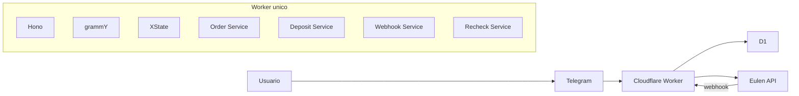

# Arquitetura Geral

## Objetivo

Descrever a forma do sistema e separar claramente a arquitetura-alvo do MVP do estado atual do repositorio.

## Stack travada

- `Cloudflare Workers`
- `Hono`
- `grammY`
- `XState`
- `Cloudflare D1`
- `Vitest` + testes de Workers + `MSW`

## Arquitetura-alvo do MVP

## Componentes principais

- `Hono`: borda HTTP e composicao de rotas
- `grammY`: runtime do bot Telegram por tenant
- `XState`: estado explicito da conversa e do pedido
- `D1`: persistencia operacional unica
- `client Eulen`: camada isolada de integracao HTTP

## Estado atual no `main`

- `Hono` ja compoe as rotas principais
- middleware de contexto e resolucao de tenant ja existem
- runtime Telegram bootstrapado em `grammY` ja existe
- webhook Telegram real ainda nao esta mergeado no `main`
- webhook Eulen e recheck ainda retornam `501`
- `XState` ainda nao entrou no codigo

## Regra de leitura

Esta pagina descreve o desenho que governa o projeto. Quando o codigo atual estiver atrasado em relacao a esse desenho, as paginas especializadas devem marcar essa diferenca em vez de mascarar o gap.
