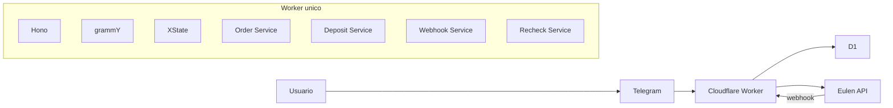

# Arquitetura Geral

## Stack travada

- `Cloudflare Workers`
- `Hono`
- `grammY`
- `XState`
- `Cloudflare D1`
- `Vitest` + testes de Workers + `MSW`

## Arquitetura-alvo

## Estado atual do `main`

- `Hono` e middleware multi-tenant ja existem
- runtime Telegram em `grammY` ja recebe despacho real do webhook
- webhook principal da Eulen ja existe com validacao, deduplicacao e atualizacao base do agregado
- recheck de deposito ainda retorna `501`
- `XState` ainda nao entrou no codigo

## Principios arquiteturais

- um unico runtime principal
- um unico banco principal
- isolamento logico por `tenantId`
- segredos fora do codigo
- contratos HTTP claros nas bordas
- sem servicos extras enquanto eles nao reduzirem complexidade real

## Leitura correta

O projeto ja tem uma arquitetura-alvo bem definida e uma fundacao concreta no `main`. O gap atual nao e falta de direcao; e falta de implementar as ultimas fatias funcionais do fluxo.
