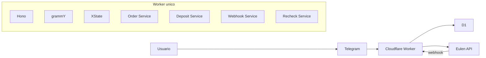

# Arquitetura Geral

## Stack travada

- `Cloudflare Workers`
- `Hono`
- `grammY`
- `XState`
- `Cloudflare D1`
- `Vitest` + testes de Workers + `MSW`

## Arquitetura-alvo

## Estado atual do `main`

- `Hono` e middleware multi-tenant ja existem
- as rotas HTTP centrais `health`, `ops`, `telegram` e `webhooks` ja estao em TypeScript
- o glue de autorizacao operacional das rotas `ops` ja esta em TypeScript
- runtime Telegram em `grammY` ja recebe despacho real do webhook
- o inbound do Telegram agora e normalizado antes de entrar no runtime, com contrato explicito para `updateKind`, `chatId`, `fromId`, `text`, `command`, `callbackData`, `hasReplyChannel` e `rawUpdateType`
- payload inbound invalido no Telegram falha fechado com erro estruturado `invalid_webhook_payload`
- o bootstrap do Worker foi migrado para TypeScript em `src/index.ts`
- a fronteira canonica de tipos do runtime ficou consolidada em `src/types/runtime.ts`
- webhook principal da Eulen ja existe com validacao, deduplicacao e atualizacao base do agregado
- recheck operacional de deposito via `POST /ops/:tenantId/recheck/deposit` ja existe
- `XState` ja existe no codigo para a progressao inicial de pedidos, isolado de transporte e side effects; o fluxo completo Telegram/Eulen ainda sera ligado em fatia posterior
- a maquina de progresso de pedidos foi migrada para TypeScript estrito, com contratos explicitos de estado, evento e contexto
- o contrato de transicao da maquina foi preservado; a compatibilidade com consumidores JS ficou restrita a imports e ao ponto de entrada carregavel
- a borda Telegram agora inclui reconsulta de deposito pendente antes de responder `/start` e `/status`, reaproveitando o caminho de reconciliacao ja existente para atualizar a resposta com o estado remoto quando a Eulen ja tiver finalizado o pagamento
- o runtime do Telegram tambem expira conversas abertas antigas antes de consumir novas mensagens ou callbacks, para evitar que pedidos parados continuem aceitando interacoes como se estivessem ativos
- `/iniciar` foi adicionado como alias de `/start` na borda Telegram
- o tempo limite de conversas abertas do Telegram agora vem de configuracao de runtime tipada e tem valor padrao quando nao configurado
- o fluxo Telegram agora persiste a mensagem canonica do pedido para permitir edicao in-place do mesmo payload em etapas posteriores do QR, status e confirmacao final
- a persistencia dessa mensagem canonica usa os campos `telegramCanonicalMessageId` e `telegramCanonicalMessageKind` no agregado `orders`
- as respostas de status, replay e confirmacao de pagamento no Telegram agora sao enviadas como mensagens novas ou fotos novas; o fluxo nao depende de `editMessageText` nem `editMessageCaption` para essas respostas

## Principios arquiteturais

- um unico runtime principal
- um unico banco principal
- isolamento logico por `tenantId`
- segredos fora do codigo
- contratos HTTP claros nas bordas
- maquina de estado pura, com persistencia explicita no D1
- sem servicos extras enquanto eles nao reduzirem complexidade real

## Leitura correta

O projeto ja tem uma arquitetura-alvo bem definida e uma fundacao concreta no `main`. O gap atual nao e falta de direcao; e falta de implementar as ultimas fatias funcionais do fluxo.
